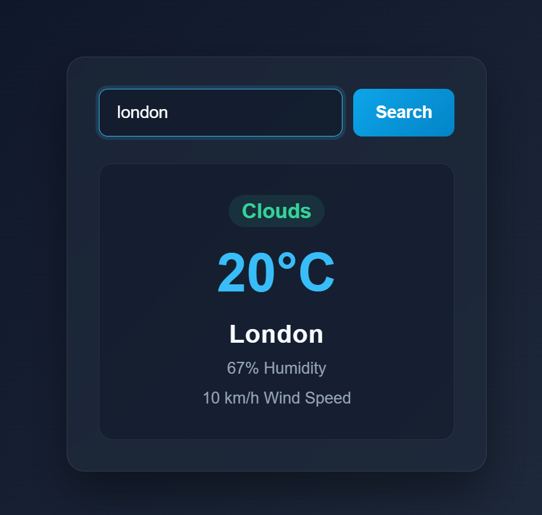

# Weather App 🌤️

A weather app built with React and the OpenWeatherMap API. Search any city to see its current weather, temperature, humidity, and wind speed.

## Live Demo
🔗 [View Live Application](https://react-weather-app-xbtv.vercel.app/)

## Screenshot



## Features
- **City Search:** Search any city by pressing `Enter` or clicking the Search button.
- **Live Weather Data:** Shows the weather condition, temperature in °C, humidity, and wind speed in km/h.
- **Error Handling:** Shows an alert for cities that aren't found and for network failures.
- **Persistent LocalStorage:** Saves your last searched city and restores it, with the search box in sync, when you reopen the app.
- **Safe Data Restore:** Checks saved data before using it, so corrupted or old data can't crash the app.
- **State Management:** Built with React functional components and hooks (`useState`, `useEffect`).
- **Responsive Design:** Works on desktop and mobile screens.

## Tech Stack
- **React** (Create React App)
- **CSS3** (Flexbox, media queries)
- **JavaScript (ES6+)** (async/await, Fetch API, React Hooks, localStorage)
- **OpenWeatherMap API**
- **Vercel** (deployment)

## Getting Started Locally
1. Clone the repository:
```bash
   git clone https://github.com/piyushdhakad001/react-weather-app.git
   cd react-weather-app
```
2. Install dependencies:
```bash
   npm install
```
3. Get a free API key from [OpenWeatherMap](https://openweathermap.org/api). New keys can take a while to activate.
4. Create a `.env` file in the project root (next to `package.json`) with:
```
   REACT_APP_WEATHER_API_KEY=your_api_key_here
```
5. Start the app:
```bash
   npm start
```
6. Open `http://localhost:3000`.

## What I Learned
- Fetching API data with async/await and handling errors with `try/catch`
- Using environment variables in React to keep API keys out of the source code
- Restoring saved state with `useEffect` and validating it before use
- Encoding user input safely in URLs with `encodeURIComponent`
- Converting units (m/s to km/h) and conditional rendering in JSX
- Deploying a React app with Vercel and setting environment variables

## Future Improvements
- Show a loading message while fetching
- Replace `alert()` with inline error messages
- Add weather icons
- Add a 5-day forecast
- Detect the user's location with the Geolocation API

## Note
## Security Note

The API key is loaded through an environment variable and is not committed to the repository. However, Create React App includes `REACT_APP_` variables in the browser bundle, so the key can still be viewed by users.

This approach is acceptable for a limited free-tier public API key, but private, paid, or sensitive API keys should be kept on a backend server.